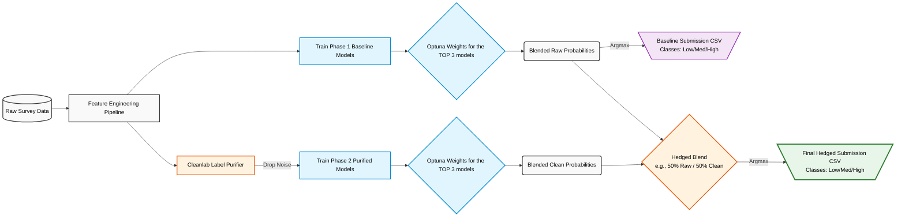

# Financial_Health_Index_Prediction_Challenge
https://zindi.africa/competitions/dataorg-financial-health-prediction-challenge

## 1. INTRODUCTION
The small and medium enterprise (SME) sector in Southern Africa represents the most critical frontier for economic development, employment creation, and social innovation. Across Eswatini, Lesotho, Zimbabwe, and Malawi, these businesses operate as the primary livelihood for millions, yet they remain fundamentally fragile and largely excluded from the formal financial systems that might otherwise provide stability during times of crisis. Traditional economic metrics, such as annual profit or gross revenue, are increasingly recognized as insufficient for capturing the actual well-being of an SME in a developing economy. Instead, a more nuanced understanding is required—one that considers the interdependencies between savings habits, debt management, resilience to idiosyncratic shocks, and the qualitative nature of financial inclusion. The Financial Health Index (FHI) addresses this need by providing a composite measure that classifies enterprises into Low, Medium, or High financial health. However, the construction of reliable machine learning models to predict the FHI is hampered by the nature of the primary data source: survey responses that are frequently incomplete, inconsistent, and influenced by a complex array of behavioral and cultural factors.

## 2. FINANCIAL HEALTH INDEX (FHI) DEFINED 
The FHI serves as a redefined metric for SME wellbeing, moving the focus from simple profitability to a holistic view of resilience and opportunity. The index is built across 4 core dimensions. These dimensions are not isolated; they interact in ways that provide hidden, cross-dimensional signals for our machine learning models.

| Dimension | Definition | Dataset Proxies (Engineered & Raw) | 
| :--- | :--- | :--- | 
| **1. Savings & Liquidity** | The accumulation of liquid capital and cash flow health required to support daily business continuity. | `business_turnover`, `personal_income`, `has_debit_card`, `current_problem_cash_flow` (Inverse) | 
| **2. Debt & Repayment** | The ability to service liabilities without compromising operational integrity or falling into a liquidity trap. | `has_loan_account`, `business_expenses`, `offers_credit_to_customers` (Capital tied up in receivables) | 
| **3. Resilience to Shocks** | Buffers and psychological readiness against unexpected events (e.g., climate events, theft, economic downturns). | `has_insurance` (and sub-types), `covid_essential_service`, `future_risk_theft_stock`, `attitude_worried_shutdown`, and all `perception_insurance_*` barriers | 
| **4. Access to Credit & Networks**| Integration into formal and informal financial service networks to secure emergency or growth funding. | `has_credit_card`, `has_mobile_money`, `has_internet_banking`, `problem_sourcing_money`, `uses_informal_lender`, `uses_friends_family_savings` |

> **Note on Structural Modifiers:** > Variables such as `country`, `owner_age`, `owner_sex`, `business_age_years/months`, and `motivation_make_more_money` are not direct components of the Financial Health Index. Instead, the models utilize these as **Structural Modifiers**—macro-level context that dictates *how* a business interacts with the 4 dimensions above. Furthermore, operational metrics (like `keeps_financial_records`, `marketing_word_of_mouth`, and `compliance_income_tax`) act as the critical bridge connecting informal SMEs to Dimension 4 (Formal Credit Networks).

## 3. CHALLENGE OBJECTIVE
Develop a robust machine learning model to accurately predict the Financial Health Index (FHI) class—Low, Medium, or High—of small and medium-sized enterprises (SMEs) using socio-economic, demographic, and business data from Eswatini, Lesotho, Zimbabwe, and Malawi. 

## 4. SYSTEM ARCHITECTURE & EXECUTION GUIDE

This section outlines the complete lifecycle of the pipeline, from the conceptual architecture hardware and commands needed to reproduce the final submission.

### 4.1. Repository Layout
To maintain a clean and modular codebase, the project is structured as follows:
```text
FHI_Prediction/
├── 📂 Custom_Transformers/    # Extracted .py files for Scikit-Learn custom classes
├── 📂 Data/                   # Raw datasets (train.csv, test.csv)
├── 📂 FHI_Models/             # Saved .joblib models and .json Optuna weights
├── 📄 Modelling_Final.ipynb   # Core pipeline: Training, Cleanlab, and Optuna tuning
├── 📄 Submission_Final.ipynb  # Inference pipeline: Loads saved models/weights for fast prediction
├── 📄 requirements.txt        # Exact package versions for reproducibility
└── 📄 submission_*.csv        # Auto-generated final prediction files for submission
```
### 4.2. Coding Environment & Notebook Runtime
Environment: Google Colab (Free Tier)

Compute / Hardware: Standard CPU Runtime. System RAM: Minimum 16GB recommended due to MICE imputation and K-Means clustering overhead.

#### Execution Path :
**Option A: Full Pipeline Retrain (Modelling_Final.ipynb)**
  - Run this notebook to execute the entire end-to-end architecture. This will ingest raw data, run the MICE imputations, execute Phase 1 (Raw Models), trigger Cleanlab label purification, drop noisy rows, execute Phase 2 (Clean Models) and dynamically save the .joblib models and .json weights in the FHI_Models folder. (Estimated Runtime: ~15 minutes when tuning=False, ~3 hours when tuning=True).

**Option B: Fast Inference (Submission_Final.ipynb)**
  - Run this notebook if you simply want to verify the submission. This notebook skips all training and Optuna tuning. It strictly loads the frozen joblib models and the pre-calculated json weights to perform a rapid Hedged Probability Fusion on the unseen test.csv data. (Estimated Runtime: < 2 minutes).

## 5. DATA DESCRIPTION
The dataset comprises real-world survey responses collected from small and medium-sized enterprise (SME) owners across four Southern African nations: Eswatini, Lesotho, Malawi, and Zimbabwe.
As this is raw survey data, it authentically reflects the messy, subjective nature of on-the-ground data collection. The data contained missing values, "Don't know" responses, refusals to answer, and extreme outliers (e.g., currency inflation or data-entry typos). Successfully navigating these anomalies was a core part of the challenge.

### 5.1 Files
1. Train.csv : The training set, containing the survey features and the target variable.
2. Test.csv : The test set. You must predict the financial health class for these unseen businesses.

### 5.2 Target Variable
Target: The Financial Health Index (FHI) classification of the business.
  - Low (Highly vulnerable, informal, or distressed)
  - Medium (Stable but potentially lacking formal infrastructure)
  - High (Resilient, formalized, and financially integrated)
    
<p align="center">
  <table>
    <tr>
      <td align="center"></td>
      <td align="center"></td>
    </tr>
    <tr>
      <td align="center"><b>Overall Imbalance</b></td>
      <td align="center"><b>Imbalance by Country</b></td>
    </tr>
  </table>
</p>

As seen in the overall distribution, the majority of businesses fall into the **Low** FHI category. These are typically informal, subsistence-level micro-businesses operating entirely in cash. On the opposite end of the spectrum, the **High** class is extremely rare, representing businesses that have successfully scaled and integrated into the formal banking sector. 
This structural imbalance persists across all four nations (Eswatini, Lesotho, Malawi, and Zimbabwe). From a machine learning perspective, this causes standard algorithms to become overly conservative, naturally defaulting to "Low" or "Medium" predictions to minimize loss. 
To counteract this and successfully capture the rare "High" performing SMEs, this project implements advanced techniques including:

1. **SMOTE Oversampling:** Synthetically generating realistic data points for "High" businesses during cross-validation to teach the model their specific traits.
2. **Confident Learning (Cleanlab):** Dropping highly-disputed, noisy majority-class survey responses rather than allowing them to dilute the tree's learning process.

### 5.3 Data Dictionary
<details>
<summary><strong>Click to expand the full dataset variable definitions</strong></summary>

| Category | Feature Name | Description |
| :--- | :--- | :--- |
| **Meta** | `ID` | Unique identifier for the surveyed SME. |
| **Target** | `Target` | The Financial Health Index tier (`Low`, `Medium`, `High`). |
| **Demographics** | `country` | The country of operation (Eswatini, Lesotho, Malawi, Zimbabwe). |
| **Demographics** | `owner_age` | The age of the primary business owner. |
| **Demographics** | `owner_sex` | The gender of the primary business owner. |
| **Firmographics** | `business_age` | The age of the business in years. |
| **Firmographics** | `keeps_financial_records` | Whether the business tracks finances (e.g., Yes, No, Sometimes). |
| **Firmographics** | `covid_essential_service` | Whether the business was classified as essential during COVID. |
| **Financial/Cash** | `business_turnover` | Approximate total revenue generated by the business. |
| **Financial/Cash** | `business_expenses` | Approximate total operating costs of the business. |
| **Financial/Cash** | `personal_income` | Total monthly income withdrawn by the owner for personal use. |
| **Financial/Cash** | `current_problem_cash_flow` | Whether the business is currently experiencing cash flow shortages. |
| **Financial/Cash** | `problem_sourcing_money` | The level of difficulty in obtaining capital for operations. |
| **Digital Access** | `has_cellphone` | Indicates ownership of a basic cellphone. |
| **Digital Access** | `has_mobile_money` | Indicates usage of mobile money services (e.g., M-Pesa). |
| **Digital Access** | `has_internet_banking` | Indicates usage of a formal web-based banking portal. |
| **Formal Credit** | `has_debit_card` | Ownership of a bank debit card. |
| **Formal Credit** | `has_credit_card` | Ownership of a bank credit card. |
| **Formal Credit** | `has_loan_account` | Indicates an active formal loan with a registered financial institution. |
| **Informal Funding**| `uses_friends_family_savings` | Reliance on personal networks to fund the business. |
| **Informal Funding**| `uses_informal_lender` | Reliance on informal or unregistered money lenders, often at high interest. |
| **Operations** | `compliance_income_tax` | Whether the business pays formal national income tax. |
| **Operations** | `offers_credit_to_customers` | Whether the business extends buy-now-pay-later credit to customers. |
| **Operations** | `marketing_word_of_mouth` | Business uses word-of-mouth as a primary marketing strategy. |
| **Insurance/Risk** | `has_insurance` | Master flag indicating whether the owner/business has active insurance. |
| **Insurance/Risk** | `motor_vehicle_insurance` | Business has active motor vehicle coverage. |
| **Insurance/Risk** | `medical_insurance` | Business/owner has active medical coverage. |
| **Insurance/Risk** | `funeral_insurance` | Business/owner has active funeral coverage. |
| **Insurance/Risk** | `future_risk_theft_stock` | Business is concerned about the future risk of inventory theft. |
| **Risk Perception** | `perception_insurance_important`| The owner's belief about the usefulness of insurance. |
| **Risk Perception** | `perception_cannot_afford_insurance` | Indicates cost as the main barrier to obtaining insurance. |
| **Risk Perception** | `perception_insurance_doesnt_cover_losses` | Owner believes insurance payouts are unreliable or insufficient. |
| **Risk Perception** | `perception_insurance_companies_dont_insure_businesses_like_yours` | Belief that formal insurers do not cater to SMEs. |
| **Psychological** | `attitude_stable_business_environment` | Confidence in the stability of the local business environment. |
| **Psychological** | `attitude_worried_shutdown` | Owner's anxiety regarding the potential failure/shutdown of the business. |
| **Psychological** | `attitude_satisfied_with_achievement`| Personal satisfaction with business progress to date. |
| **Psychological** | `attitude_more_successful_next_year` | Optimism about stronger business performance in the coming year. |
| **Psychological** | `motivation_make_more_money` | Primary motivation for running the business is financial gain. |

</details>

## 6. DATA PREPROCESSING AND FEATURE ENGINEERING

### 6.1. Robust Data Sanitization
* **Country-Aware Winsorization:** Because Eswatini, Lesotho, Malawi, and Zimbabwe have vastly different currencies and inflation rates, extreme financial outliers were capped at the 99th percentile *per country*. This neutralized data-entries without erasing legitimate high-earning businesses.
* **Logical Bounding:** Corrected impossible survey contradictions automatically (e.g., ensuring a business's age could not be negative).

### 6.2. Feature Engineering & Unsupervised Extraction
* **Domain-Driven Base Signals:** Translated raw survey text into mathematical indices. Created custom metrics like the `Master_Formalization_Index` (tracking tax and record-keeping compliance) and `Liquidity_Distress_Index` (multiplying high cash burn rates by negative psychological outlooks).
* **Unsupervised Pattern Extraction (K-Means):** Applied log transformations to revenue and expenses, then used a K-Means clustering algorithm to group businesses into distinct "Financial Maturity Tiers," allowing the gradient boosters to immediately recognize scale.
* **MICE Imputation:** Instead of filling missing continuous variables with a naive median, the pipeline uses Scikit-Learn's `IterativeImputer` (Multivariate Imputation by Chained Equations) to mathematically predict and fill missing values based on the business's other characteristics.

### 6.3. Handling Imbalance & Multicollinearity
* **Custom SMOTE Ratios:** To combat the severe class imbalance, Synthetic Minority Over-sampling Technique (SMOTE) was used. However, instead of a naive 1:1:1 balance, custom ratios were applied to gently boost the ultra-rare "High" class without flooding the dataset with synthetic noise.
* **Dynamic Correlation Drop:** A custom transformer automatically calculates a correlation matrix during training and drops heavily collinear features (Pearson > 0.90). This reduces dimensionality and prevents tree-based models from overfitting on redundant information.

### 6.4. Confident Learning 
* **Cleanlab Label Purification:** Survey data is full of human error. By using a highly constrained, shallow LightGBM "Judge," the pipeline flags rows where the Out-Of-Fold probability violently disagrees with the human label. By *dropping* these mathematically improbable rows (rather than attempting to relabel them), the final models learn on a purified, contradiction-free dataset.

## 7. MODEL EVALUATION AND SELECTION PIPELINE
### 7.1. Stratified Validation & Early Stopping
Models are not trained blindly for a set number of epochs. Evaluation relies on a strict **Stratified 80/20 Validation Split**, ensuring the exact distribution of Low/Medium/High classes is preserved in the holdout set. Furthermore, **Early Stopping** is actively monitored on the validation set. Once a model stops improving its Out-Of-Fold F1-Score, training is halted, the exact optimal tree count is locked in, and the model is refit on 100% of the data to prevent data leakage and overfitting.

### 7.2. The Evaluation Metric: Weighted F1-Score
The primary optimization metric for this pipeline is the **Weighted F1-Score**. Because the dataset suffers from severe class imbalance (the vast majority of SMEs are in the "Low" health tier), relying on standard Accuracy would be highly misleading. The Weighted F1-Score calculates the harmonic mean of precision and recall for each class and weights them by their actual support in the data, strictly penalizing models that lazily guess the majority class.

### 7.3. The Dual-Pipeline Strategy (Standard vs. Patterns)
For every base algorithm tested (**Random Forest**, **Extra Trees**, **XGBoost**, and **CatBoost**), the pipeline automatically generates and evaluates two distinct variations:
* **The "Standard" Pipeline:** Feeds the model the cleaned data alongside the core domain ratios (e.g., Burn Rate, Formalization Index).
* **The "Patterns" Pipeline:** Injects the highly complex, unsupervised features (e.g., K-Means Maturity Clusters, High-Value Interactions).
*(By testing both, the ensemble engine can later blend a "Standard" model that learned broad macroscopic trends with a "Patterns" model that captured hyper-specific edge cases).*

### 7.4. Ensembling Strategy: Optuna-Optimized Soft Voting

To generate the final predictions, the pipeline moves away from relying on a single algorithm and instead utilizes a highly optimized **Weighted Soft Voting Ensemble**. 

#### 7.4.1. Top-K Filtering (Preventing Ensemble Dilution)
A common pitfall in machine learning is averaging *all* trained models together, which allows weaker algorithms to lower the accuracy of the best ones. To prevent this, the pipeline strictly enforces a **Top-K cutoff**. Only the top-performing models (based strictly on Out-Of-Fold weighted F1 validation scores) are used in the final ensemble.

#### 7.4.2. Optuna Weight Optimization
Instead of using a naive simple average (e.g., giving LightGBM, XGBoost, and CatBoost an equal 33% say), the engine leverages **Optuna (Tree-structured Parzen Estimator)**. Optuna runs hundreds of trials on the validation probabilities to discover the mathematically perfect fractional weights. For example, if LightGBM captured a vital macroeconomic trend, Optuna might dynamically assign it 55% voting power, while relegating CatBoost to 15%.

> **The Optuna Caveat (Handling Non-Determinism):** > It is important to note that Optuna’s Tree-structured Parzen Estimator (TPE) is inherently stochastic. Because it explores the hyperparameter space randomly, it can arrive at slightly different final weights on every run - even if the underlying models and their validation scores do not change. Furthermore, in an ensemble, multiple distinct weight combinations can frequently yield the exact same optimal F1-score.

> **The Solution:** To prevent this non-determinism from altering our final submission, we treated Optuna purely as an exploratory tool. Once the absolute highest cross-validation score was achieved, the resulting optimal weights were frozen, exported to a `.json` file, and hardcoded into the final submission notebook to guarantee 100% reproducibility.

#### 7.4.3. Probability Fusion & Final Argmax
Once the optimal weights are discovered, the pipeline extracts the raw continuous probabilities (confidence levels) from the Top K models on the unseen Test Set. These probabilities are multiplied by their respective Optuna weights and stacked together. Finally, the default `Argmax` function collapses this fused probability matrix into the final discrete predictions (`Low`, `Medium`, `High`), yielding a submission that is significantly more robust than any individual model could achieve alone.

#### 7.4.4. The Hedged Fusion (Raw + Purified Blending)
The final step of the pipeline mitigates the risks of both underfitting and overfitting to noise. We generate two separate Optuna-weighted ensembles: one trained on the **Raw Data** and one trained on the **Cleanlab Purified Data**. By fusing their probabilities together (e.g., a 50% Raw / 50% Clean split), we create a "Hedged Ensemble." The Raw models act as a grounded anchor to the true, messy real-world distribution, while the Purified models act as a precise mathematical corrector, pulling the predictions back into bounds when the raw models become overconfident on tricky, noisy edge cases.

## 8. MODEL PERFORMANCE
### 8.1 Top 3 Models before cleaning
This was trained on the full dataset (9618 rows)
| Model | F1 Weighted | Ensemble Weight Assigned |
|---|---|---:|
| RandomForest_Patterns  | 88.9182 |  0.7105824251537074 |
| ExtraTrees_Standard  |  88.7962 | 0.05200313738932137 |
| ExtraTrees_Patterns | 88.7536 |  0.23741443745697116 |

<details>
<summary><strong>Click to expand classification reports</strong></summary>
  
**Classification Report (Weighted F1: 0.89)**
| Class | Precision | Recall | F1-Score | Support (Rows) |
| :--- | :--- | :--- | :--- | :--- |
| **High** | 0.92 | 0.62 | 0.74 | 94 |
| **Low** | 0.90 | 0.98 | 0.94 | 1256 |
| **Medium** | 0.89 | 0.76 | 0.82 | 574 |
| Overall Accuracy | | | 0.90 | 1924 |

**Confusion Matrix**
| | Predicted High Class | Predicted Low Class | Predicted Medium class |
| :--- | :---: | :---: | :---: |
| **Actual High Class** | **58** | 4 | 32 |
| **Actual Low Class** | 1 | **1231** | 24 |
| **Actual Medium class** | 4 | 133 | **437** |
</details>

### 8.2 Top 3 Models on cleaned data ( Out of the original 9618 rows, 633 rows were dropped)
This was trained on 8,985 rows
| Model | F1 Weighted | Ensemble Weight Assigned |
|---|---|---:|
| ExtraTrees_Standard  | 94.9658 | 0.4566714412265409 |
| ExtraTrees_Patterns  | 94.8519 | 0.24944312727789425 |
| XGBoost_Standard | 94.5441 |  0.29388543149556484 |

<details>
<summary><strong>Click to expand classification reports</strong></summary>
  
**Classification Report (Weighted F1: 0.95)**
| Class | Precision | Recall | F1-Score | Support (Rows) |
| :--- | :--- | :--- | :--- | :--- |
| **High** | 0.98 | 0.98 | 0.98 | 60 |
| **Low** | 0.95 | 0.99 | 0.97 | 1237 |
| **Medium** | 0.96 | 0.87 | 0.91 | 500 |
| Overall Accuracy | | | 0.95 | 1707 |

**Confusion Matrix**
| | Predicted High Class | Predicted Low Class | Predicted Medium class |
| :--- | :---: | :---: | :---: |
| **Actual High Class** | **50** | 1 | 0 |
| **Actual Low Class** | 0 | **1221** | 16 |
| **Actual Medium class** | 1 | 66 | **433** |
</details>

### 8.3 Submission File Performance on Leaderboard
Blending Weight : 0.5

| Submission | Public Leaderboard | Private Leaderboard |
|---|---:|---:|
| Base Ensembled Submission | 89.2531213 | 88.4738645 |
| Cleaned Ensembled Submission | 88.7188694 | 88.2349274 |
| Base+cleaned Blended Submission  | 89.1167192 | 88.3463601 |

## 9.DISCUSSION AND CONCLUSION

During the evaluation phase, an advanced Confident Learning pipeline (Cleanlab) was utilized to identify and drop 633 highly disputed, noisy rows from the training set. Initially, this appeared highly successful: the local Out-Of-Fold Weighted F1-Score surged from **88.91** (Base) to **94.96** (Cleaned). 

However, evaluating these models on the unseen test set revealed a classic case of **distribution shift**:
* **The Base Ensemble** (trained on raw, noisy data) scored the highest on the Private Leaderboard (**88.47**).
* **The Cleaned Ensemble** (trained on purified data) saw a performance drop on the Private Leaderboard (**88.23**).

**The Key Takeaway:** The hidden test set inherently contained the exact same human errors, edge cases, and noise as the raw training data. By aggressively dropping the "confusing" rows, the Cleaned models overfit to a perfect distribution that did not actually exist in the real world. They effectively "forgot" how to predict messy edge cases. 

Ultimately, the most robust strategy was to rely on the **Base Ensembled Submission** (anchored by the `RandomForest_Patterns` model), which successfully learned to navigate the noise, proving that for real-world survey data, a model's ability to generalize to messiness is often more valuable than achieving a perfect local validation score on sanitized data.


