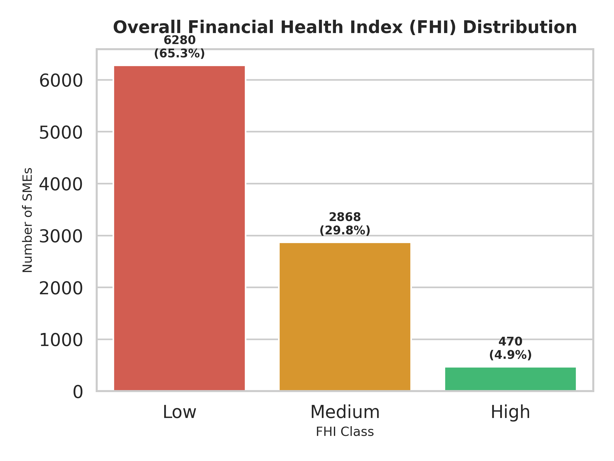
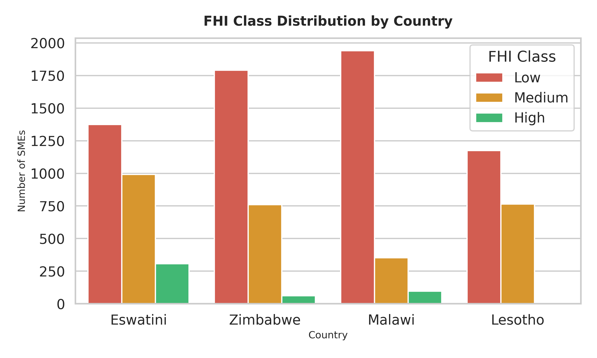

# Financial_Health_Index_Prediction_Challenge
https://zindi.africa/competitions/dataorg-financial-health-prediction-challenge

## INTRODUCTION
The small and medium enterprise (SME) sector in Southern Africa represents the most critical frontier for economic development, employment creation, and social innovation. Across Eswatini, Lesotho, Zimbabwe, and Malawi, these businesses operate as the primary livelihood for millions, yet they remain fundamentally fragile and largely excluded from the formal financial systems that might otherwise provide stability during times of crisis. Traditional economic metrics, such as annual profit or gross revenue, are increasingly recognized as insufficient for capturing the actual well-being of an SME in a developing economy. Instead, a more nuanced understanding is required—one that considers the interdependencies between savings habits, debt management, resilience to idiosyncratic shocks, and the qualitative nature of financial inclusion. The Financial Health Index (FHI) addresses this need by providing a composite measure that classifies enterprises into Low, Medium, or High financial health. However, the construction of reliable machine learning models to predict the FHI is hampered by the nature of the primary data source: survey responses that are frequently incomplete, inconsistent, and influenced by a complex array of behavioral and cultural factors.

## FINANCIAL HEALTH INDEX (FHI) DEFINED 
The FHI serves as a redefined metric for SME wellbeing, moving the focus from simple profitability to a holistic view of resilience and opportunity. The index is built across 4 dimensions. These dimensions are not isolated; they interact in ways that provide hidden information for data recovery.
| Dimension | Definition | Dataset proxies | 
| :--- | :--- | :--- | 
| **Savings & Assets** | The accumulation of liquid and fixed capital to support business continuity. | personal_income, has_credit_card, has_debit_card, uses_friends_family_savings  | 
| **Debt & Repayment** | The ability to service liabilities without compromising operational integrity. | has_loan_account, offers_credit_to_customers, business_expenses  | 
| **Resilience to shocks** | Buffers against unexpected events like climate events or health crises. | has_insurance, medical_insurance, attitude_worried_shutdown  | 
| **Access to credit** | Integration into formal and informal financial service networks. | has_mobile_money, has_internet_banking, problem_sourcing_money  | 

## CHALLENGE OBJECTIVE
Develop a robust machine learning model to accurately predict the Financial Health Index (FHI) class—Low, Medium, or High—of small and medium-sized enterprises (SMEs) using socio-economic, demographic, and business data from Eswatini, Lesotho, Zimbabwe, and Malawi. 

## REPOSITORY LAYOUT
## CODING ENVIRONMENT
## HOW TO RUN THE CODE
## NOTEBOOK RUNTIME
## ARCHITECTURAL DIAGRAM
## DATA DESCRIPTION
The dataset comprises real-world survey responses collected from small and medium-sized enterprise (SME) owners across four Southern African nations: Eswatini, Lesotho, Malawi, and Zimbabwe.
As this is raw survey data, it authentically reflects the messy, subjective nature of on-the-ground data collection. The data contained missing values, "Don't know" responses, refusals to answer, and extreme outliers (e.g., currency inflation or data-entry typos). Successfully navigating these anomalies was a core part of the challenge.

### Files
1. Train.csv : The training set, containing the survey features and the target variable.
2. Test.csv : The test set. You must predict the financial health class for these unseen businesses.

### Target Variable
Target: The Financial Health Index (FHI) classification of the business.
  - Low (Highly vulnerable, informal, or distressed)
  - Medium (Stable but potentially lacking formal infrastructure)
  - High (Resilient, formalized, and financially integrated)
    
<p align="center">
  <table>
    <tr>
      <td align="center"></td>
      <td align="center"></td>
    </tr>
    <tr>
      <td align="center"><b>Overall Imbalance</b></td>
      <td align="center"><b>Imbalance by Country</b></td>
    </tr>
  </table>
</p>

As seen in the overall distribution, the majority of businesses fall into the **Low** FHI category. These are typically informal, subsistence-level micro-businesses operating entirely in cash. On the opposite end of the spectrum, the **High** class is extremely rare, representing businesses that have successfully scaled and integrated into the formal banking sector. 
This structural imbalance persists across all four nations (Eswatini, Lesotho, Malawi, and Zimbabwe). From a machine learning perspective, this causes standard algorithms to become overly conservative, naturally defaulting to "Low" or "Medium" predictions to minimize loss. 
To counteract this and successfully capture the rare "High" performing SMEs, this project implements advanced techniques including:

1. **SMOTE Oversampling:** Synthetically generating realistic data points for "High" businesses during cross-validation to teach the model their specific traits.
2. **Confident Learning (Cleanlab):** Dropping highly-disputed, noisy majority-class survey responses rather than allowing them to dilute the tree's learning process.

### Data Dictionary
| Category | Feature Name | Description |
|---|---|---|
| Demographics | country | The country of operation (Eswatini, Lesotho, Malawi, Zimbabwe). |
| Demographics | owner_age | The age of the primary business owner. |
| Demographics | owner_sex | The gender of the primary business owner. |
| Firmographics | business_age | The age of the business in years. |
| Firmographics | keeps_financial_records | Whether the business tracks finances (for example: Yes, No, Sometimes, Missing). |
| Financial/Cash | business_turnover | Total raw revenue generated by the business. |
| Financial/Cash | business_expenses | Total operating costs of the business. |
| Financial/Cash | personal_income | The amount of business income withdrawn by the owner for personal use. |
| Financial/Cash | current_problem_cash_flow | Whether the business is currently experiencing cash flow shortages. |
| Financial/Cash | problem_sourcing_money | The level of difficulty in obtaining capital for operations. |
| Digital Access | has_cellphone | Indicates ownership of a basic cellphone. |
| Digital Access | has_mobile_money | Indicates usage of mobile money services (for example, M-Pesa). |
| Digital Access | has_internet_banking | Indicates usage of a formal web-based banking portal. |
| Formal Credit | has_debit_card | Ownership of a bank debit card. |
| Formal Credit | has_credit_card | Ownership of a bank credit card. |
| Formal Credit | has_loan_account | Indicates an active formal loan with a registered financial institution. |
| Informal Funding | uses_friends_family_savings | Reliance on personal networks to fund the business. |
| Informal Funding | uses_informal_lender | Reliance on informal or unregistered money lenders, often at high interest. |
| Compliance | compliance_income_tax | Whether the business pays formal national income tax. |
| Compliance | offers_credit_to_customers | Whether the business extends buy-now-pay-later credit to customers. |
| Insurance/Risk | has_insurance | Master flag indicating whether the owner or business has any active insurance policy. |
| Insurance/Risk | medical_insurance / motor_vehicle_insurance / funeral_insurance | Specific types of insurance coverage possessed by the owner or business. |
| Risk Perception | perception_insurance_important | The owner's belief about the usefulness of insurance. |
| Risk Perception | perception_cannot_afford_insurance | Indicates cost as the main barrier to obtaining insurance. |
| Psychological | attitude_stable_business_environment | Confidence in the stability of the local business environment. |
| Psychological | attitude_satisfied_with_achievement | Personal satisfaction with business progress to date. |
| Psychological | attitude_more_successful_next_year | Optimism about stronger business performance in the coming year. |

## DATA PREPROCESSING AND FEATURE ENGINEERING
```mermaid
flowchart LR
    %% Data Ingestion & Prep
    Data[(Raw Survey Data)] --> Prep[Feature Engineering Pipeline]
    
    %% Phase 1: Raw Baseline
    Prep --> Phase1[Phase 1: Train Baseline Models]
    Phase1 --> TopK1[Select Top K Raw Models]
    TopK1 --> Probs1(Raw Probabilities)
    
    %% Phase 2: Cleanlab Purification
    Prep --> Clean[Cleanlab Label Purifier]
    Clean -->|Drop Noisy Rows| Phase2[Phase 2: Train Purified Models]
    Phase2 --> Top K[Select Top K Clean Models]
    TopK --> Probs(Clean Probabilities)
    
    %% Final Fusion
    Probs1 --> Blend{Hedged Probability Blend<br>e.g. 50% Raw / 50% Clean}
    Probs2 --> Blend
    
    Blend --> Final(((Final FHI Prediction)))

    %% High-Contrast Styling (Dark Text on Light Backgrounds)
    classDef default fill:#f9f9f9,stroke:#333,stroke-width:2px,color:#000;
    classDef highlight fill:#e1f5fe,stroke:#0288d1,stroke-width:2px,color:#000;
    classDef accent fill:#fff3e0,stroke:#e65100,stroke-width:2px,color:#000;
    classDef target fill:#e8f5e9,stroke:#2e7d32,stroke-width:3px,color:#000;
    
    class Phase1,Phase2,TopK1,TopK2 highlight;
    class Clean,Blend accent;
    class Final target;
```
